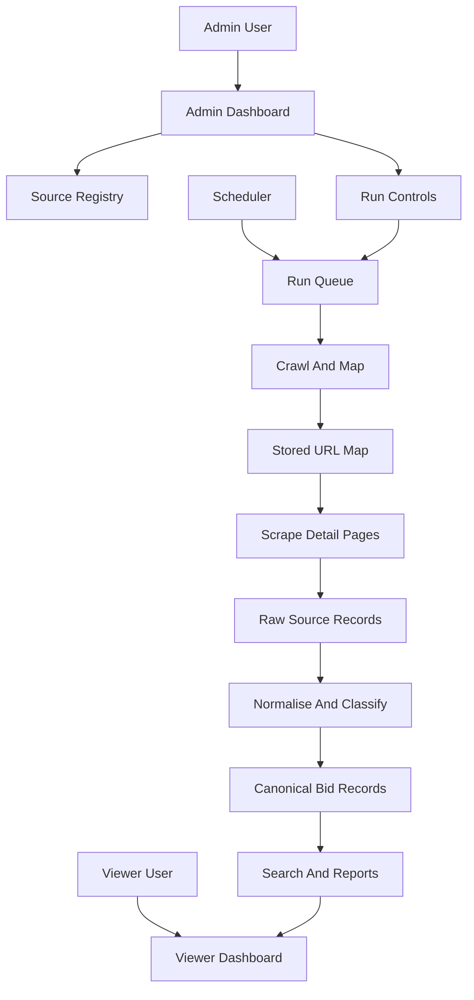

# Glassspider Bid Intelligence MVP Plan

## Current Starting Point

The repo is a greenfield product shell: [README.md](README.md), [docs/CURRENT_STATE.md](docs/CURRENT_STATE.md), [docs/README.md](docs/README.md), [AGENTS.md](AGENTS.md), and Cursor rules exist, but there is no app scaffold, package manifest, route tree, Supabase client code, migration set, or worker runtime yet.

The plan should preserve the Laightworks hub-and-spoke model:

- `glassspider` is an independent subdomain product.
- Server-side Supabase session validation is required before protected UI/data renders.
- Product access must use `PROJECT_SLUG = "glassspider"` and shared hub access tables after verifying the live schema.
- All product-owned database tables must use the `glassspider_` prefix.
- `docs/CURRENT_STATE.md` must be updated whenever routes, env vars, integrations, or schema-relevant assumptions change.

## Proposed Product Shape

## Implementation Phases

### Phase 0: Repo and Architecture Foundation

Create the application scaffold and establish the product conventions before business features:

- Add a Next.js App Router, TypeScript, Tailwind-style scaffold unless sibling Laightworks apps indicate a different standard.
- Add shared constants such as `PROJECT_SLUG = "glassspider"` in a single server-safe module.
- Add Supabase SSR/server helpers and middleware/layout checks for shared Laightworks auth.
- Verify live Supabase tables for project registry/access before writing queries or RLS policies.
- Document env vars, scripts, routes, and deployment assumptions in [README.md](README.md) and [docs/CURRENT_STATE.md](docs/CURRENT_STATE.md).

### Phase 1: Database Design and Access Model

Define the minimum schema for a configurable scraping product, using only `glassspider_*` tables for product data.

Initial table groups:

- `glassspider_sources`: procurement/source definitions, base URLs, active flags, crawl cadence, notes, compliance status.
- `glassspider_source_rules`: include/exclude URL patterns, listing/detail selectors, pagination hints, extraction hints.
- `glassspider_crawl_runs` and `glassspider_scrape_runs`: run status, counts, timing, failure summaries, triggered-by user/schedule.
- `glassspider_discovered_urls`: URL map, source, URL type, crawl depth, status, content hash, last seen, rule match.
- `glassspider_raw_records`: raw page text/HTML-derived text, source metadata, extraction attempt status.
- `glassspider_bid_records`: canonical searchable bid/award records, contract values, dates, buyers, suppliers, sector, renewal estimate.
- `glassspider_classifications`: AI/rule-derived labels, confidence, prompt version, review state.
- `glassspider_saved_searches` and possibly `glassspider_exports`: viewer-facing workflow support.

Access model:

- Admins can manage sources, rules, schedules, runs, and review queues.
- Viewers can search, filter, view, save, and export bid records.
- Trusted backend workers may use service role only server-side.
- Browser clients must never receive service-role keys.

Add [docs/DB_CURRENT_STATE.md](docs/DB_CURRENT_STATE.md) once SQL/RLS is introduced, and link it from [docs/README.md](docs/README.md).

### Phase 2: Admin Source Configuration MVP

Build the admin UI before broad scraping so sources are not hardcoded into scattered code.

Admin MVP pages:

- `/admin`: source health, recent runs, failure summary.
- `/admin/sources`: list/create/edit source definitions.
- `/admin/sources/[id]`: source rules, entry URLs, cadence, compliance notes.
- `/admin/runs`: crawl/scrape run history.
- `/admin/url-map`: discovered URLs with filters for source, status, type, and last seen.

This phase should support one source configuration end-to-end, but the UI/data model should already allow more sources later.

### Phase 3: Source Investigation and Worker Stack Decision

Before choosing the scraper runtime, investigate the first source in detail and decide between:

- Python worker with Scrapy/Playwright for stronger crawling ergonomics.
- TypeScript worker/API job runner with Playwright/Cheerio for a single-language stack.
- A mixed model where Next.js owns UI/API and a separate worker owns crawling/scraping.

Decision criteria:

- Static HTML vs JS-rendered pages.
- Pagination/search endpoint structure.
- Rate-limit and robots/terms constraints.
- Deployment target and scheduler options.
- Ease of storing run logs and partial failures.

Recommended MVP source strategy: implement one live scraper first, likely BidStats if it best supports historical award/renewal use cases, while keeping Contracts Finder and Find a Tender as planned next sources.

### Phase 4: Crawl and URL Map

Implement the first crawler path:

- Start from configured entry URLs.
- Follow configured include/exclude rules.
- Store discovered URLs instead of immediately extracting everything.
- Classify URLs as listing, detail, award notice, document, or unknown where possible.
- Track HTTP status, content hash, first seen, last seen, and crawl run.
- Show results in `/admin/url-map` so source structure can be inspected.

This phase proves the “mapping” idea from the conversation and gives admin visibility before deeper extraction.

### Phase 5: Scrape, Normalise, and Classify

Implement a detail-page scrape for approved/matched URLs:

- Save raw text and source metadata first.
- Extract deterministic fields with source-specific rules where available: title, buyer, winner, published date, award date, value, duration, start/end dates, source reference.
- Normalise dates, money, buyer/supplier names, regions, sectors, and CPV codes into canonical records.
- Use AI only for ambiguous classification and summarisation: civils relevance, highways/rail/building categories, renewal clues, suitability notes.
- Store AI output separately with confidence, model/prompt version, and review state.

Initial canonical views should answer:

- Which contracts are relevant to civil infrastructure?
- Who won them?
- What were they worth?
- When did they start/end?
- When might they renew?
- Which records need manual review?

### Phase 6: Viewer Search and Reporting

Build viewer-facing pages after useful records exist:

- `/dashboard`: high-level bid intelligence overview.
- `/dashboard/search`: filtered search over canonical bid records.
- `/dashboard/records/[id]`: detail view with source link, raw excerpt, extraction confidence, renewal estimate.
- `/dashboard/renewals`: contracts grouped by next 3, 6, 12, and 24 months.
- Optional exports after access rules are stable.

Start with Postgres filtering/full-text search. Defer Elasticsearch/OpenSearch until dataset size or fuzzy search needs justify the extra service.

### Phase 7: Automation, Monitoring, and Operations

Add scheduled execution after manual runs are stable:

- Per-source crawl and scrape cadence.
- Rate limiting and retry policy.
- Failure queues and retry controls.
- Run logs with pages visited, URLs discovered, records extracted, records updated, AI calls, costs, and errors.
- Alerts for repeated source failures.
- Manual rerun controls for admins.

## MVP Definition

The first useful MVP is not “all tender websites scraped.” It is:

- Authenticated Laightworks subdomain app with admin/viewer separation.
- Configurable source registry.
- One live source mapped and scraped end-to-end.
- Stored URL map visible in admin UI.
- Raw and canonical bid records saved in Supabase.
- Civil infrastructure classification and renewal estimate available for scraped records.
- Viewer dashboard/search for the resulting data.
- Docs updated to reflect routes, env vars, schema, and operational assumptions.

## Deferred Until After MVP

- Elasticsearch/OpenSearch search layer.
- Multiple live procurement sources.
- Downloading protected attachments or full tender packs.
- Authentication-required portals.
- Advanced duplicate/entity resolution.
- Email alerts and saved-search notifications.
- General-purpose scraping service branding beyond bid intelligence.
- Complex forecasting beyond deterministic end-date/duration/extension rules.

## Key Risks

- Some target sites may prohibit scraping or block automation; each source needs terms/robots review.
- Historical award data may be incomplete, making renewal estimates uncertain.
- AI extraction costs can grow quickly if raw pages are sent wholesale; use deterministic parsing first.
- Shared Supabase schema changes can affect Laightworks and sibling products; verify live schema and use prefixed tables.
- Worker deployment choice has real impact and should follow source investigation, not precede it.