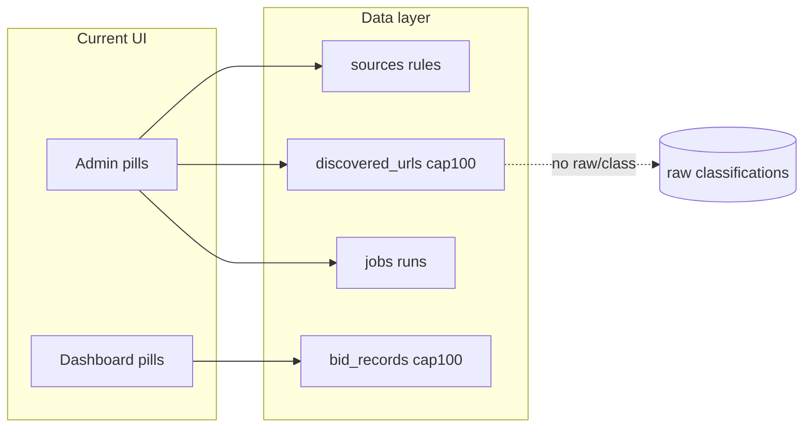
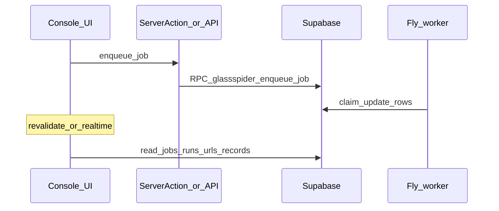

# Frontend Refactor Plan

## Problems with current UI

### SaaS/marketing framing instead of a control panel

- **[`app/layout.tsx`](app/layout.tsx)** uses a sparse top nav (`Dashboard` | `Admin`) with no hierarchical navigation or workflow cues.
- **[`app/page.tsx`](app/page.tsx)** is a product landing hero (“Bid intelligence”, “Laightworks product”) plus static MVP bullets—misaligned with an internal crawler console.
- **[`components/shell.tsx`](components/shell.tsx)** repeats SaaS patterns: eyebrow uppercase label, oversized `text-4xl` title, long marketing descriptions, horizontal pill `navItems` duplicated on every page (not persistent primary nav).

### `/admin` audit (functional but fragmented)

| Route | Purpose today | Gaps vs required workflow |
|-------|---------------|------------------------------|
| [`/admin`](app/admin/page.tsx) | KPI cards (sources/runs/url counts, latest run status) | Reads as “marketing overview”; no workflow breadcrumb into next step |
| [`/admin/sources`](app/admin/sources/page.tsx) | List sources; create source; seed BidStats | No inline rule editing beyond drill-down |
| [`/admin/sources/[id]`](app/admin/sources/[id]/page.tsx) | List rules; add rule form | **No rule tester**, no crawl-from-here shortcut, patterns not validated live |
| [`/admin/url-map`](app/admin/url-map/page.tsx) | Table of discovered URLs (**limit 100** from [`listDiscoveredUrls`](lib/db.ts)); per-row “Queue scrape” | **No server-side/filtered query**, no multi-select bulk scrape, **no URL inspection drawer**, no linkage to crawl run |
| [`/admin/runs`](app/admin/runs/page.tsx) | Forms to queue crawl/scrape/classify ([`enqueueJob`](lib/jobs.ts) / RPC); lists jobs (**payload JSON**) and runs (**error_message**, counts only) | **No logs stream**, no job↔run deep link, **`job.result`** not surfaced, **poll/real-time** absent—UI refreshes only on navigation / `revalidatePath` |

### `/dashboard` audit (“viewer” is really another half of the pipeline)

| Route | Purpose today | Gaps |
|-------|---------------|------|
| [`/dashboard`](app/dashboard/page.tsx) | Bid-centric stats + latest records | “Renewal/intelligence” product story; doesn’t expose pipeline state |
| [`/dashboard/search`](app/dashboard/search/page.tsx) | Filters **in-memory** over **`listBidRecords` (limit 100)** | Weak search vs DB **`search_vector` / FTS**—no unified explorer across tables |
| [`/dashboard/renewals`](app/dashboard/renewals/page.tsx) | Renewal-focused subset of same dataset | Narrative mismatch for generic “control panel” |
| [`/dashboard/records/[id]`](app/dashboard/records/[id]/page.tsx) | Canonical **[`BidRecord`](lib/types.ts)** fields only | **`glassspider_raw_records` and `glassspider_classifications` unused** despite schema ([migration](supabase/migrations/20260426000000_glassspider_bid_intelligence_initial_schema.sql)); no raw text, metadata JSON, classifier output |

### Architectural gaps (explicit)

1. **No “explore any URL”** — nothing fetches/arbitrates arbitrary URLs outside configured sources/worker jobs.
2. **No interactive URL inspection** — URL map only external links + table columns; no response preview, headers, extracted links in-app.
3. **Weak job/run visibility** — payloads shown; **`result`** and worker logs not in UI; jobs and runs aren’t correlated in one view.
4. **Static UI model** — almost all **[RSC + server actions](app/admin/actions.ts)** (`revalidatePath`); **no intentional refresh, Supabase Realtime, or polling** while workers run.
5. **No unified data explorer** — [`lib/db.ts`](lib/db.ts) only exposes a thin slice (`limit` 50–100, no pagination, no **`glassspider_raw_records` / classifications** accessors in app code).

---

## New UX Model

Replace “Admin vs Viewer / bid product” mental model with a **single operator console** oriented to the canonical pipeline:

1. **Configure source** (`/sources`)
2. **Crawl / discover** (trigger from runs or source; outcomes in `/url-map`)
3. **Inspect & select URLs** (`/url-map` + inspector)
4. **Scrape selection** (`/runs` or inline actions)
5. **Browse extracted data** (`/data`)
6. **Drill into a record** (`/records/[id]` with canonical + raw + classifications)

**`/explore`** is a sandbox (admin-gated): arbitrary URL preview and link harvesting to **inform rules**—not necessarily writing to prod tables until explicitly attached to a source job (product decision).

**Global chrome:** persistent **sidebar** (workflow order + contextual shortcuts), **main** workspace, optional **right inspector** (URL detail, job detail, record metadata) toggled by selection or route.

**Auth:** keep [`requireAdminAccess`](lib/auth.ts) / [`requireProductAccess`](lib/auth.ts) but **nav labels and IA** should reflect operations, not “Admin” vs “Dashboard”. Options: operational routes under one `(panel)` layout with **section-level** role checks (`viewer` reads `/data`/`/records/*`; crawler config requires admin)—exact matrix should be finalized when routing is unified.

Replace [`/`](app/page.tsx) with a minimal **post-auth entry** (redirect to `/sources` or `/url-map`, or concise non-marketing launcher).

---

## Page Structure

| New route | Responsibility |
|-----------|----------------|
| **`/explore`** | Input URL; lightweight fetch/preview via **secure API route + allowlist SSRF safeguards**); list links on page; **pattern suggestions** (heuristics / path segments / optional regex helpers)—no DB write unless explicitly “promote to source rule” flows later |
| **`/sources`** | Port [`/admin/sources`](app/admin/sources/page.tsx) + [`[id]`](app/admin/sources/[id]/page.tsx): list, create, rules CRUD (extend actions as needed) |
| **`/url-map`** | Port URL map with **server-driven filters** (source, `url_type`, `status`, text search), **pagination**, **row selection** + bulk “queue scrape”, row opens **inspector** |
| **`/runs`** | Job queue + run history; **unified timeline** (job created → run row); show **`result`**, errors, attempt history; link to affected URLs/records where IDs exist in payload/result |
| **`/data`** | Table of extracted records: merge **search / renewals** into facets; support **FTS** (Postgres `search_vector` or Supabase `textSearch`) and export |
| **`/records/[id]`** | Full **structured** bid row + joined **`glassspider_raw_records`** + **`glassspider_classifications`**; external source link; review status actions if allowed |

**Implementation note:** Introduce a **route group** e.g. `app/(console)/layout.tsx` for sidebar + inspector shell; **redirect** legacy `/admin/*` and `/dashboard/*` to new paths to avoid dead bookmarks (phase 1 or 2).

---

## Component Architecture

| Component | Role |
|-----------|------|
| **`AppSidebar`** | Primary nav, workflow labels, optional environment badge, user/sign-out if applicable |
| **`ConsoleLayout`** | CSS grid: `sidebar | main | inspector?`; responsive collapse |
| **`InspectorPanel`** | Slot for URL / job / record context; close, resize, tabs |
| **`DataTable`** | Shared table: sortable headers, pagination props, row selection, empty/error states (build on headless pattern or light custom—avoid duplicating per page) |
| **`URLPreview`** | Sandboxed HTML preview or read-only rendered snippet + status line (URL, final redirect, content-type) |
| **`LinkExtractor`** | Parsed `<a href>` list with origin filter, dedupe, copy-as-pattern |
| **`RunStatusPanel`** | Job + run fields, attempt badge, **expandable JSON** for payload/result, **log placeholder** (wire when log storage exists) |
| **`SourceForm`** | Extract from current [`createSource`](app/admin/actions.ts) form fields with validation feedback |
| **`RuleTester`** | Client calls API with sample URL(s) + rule set; shows first matching rule / no match (server-side evaluation to mirror worker semantics) |

Optional smaller pieces: **`JobQueueCard`**, **`RunTelemetryList`**, **`BulkActionBar`** (selected URLs), **`RecordProvenanceBlock`** (raw + classification timeline).

---

## Data Flow

### Fetching

- **Prefer RSC `async` pages** reading Supabase via existing [`createSupabaseServerClient`](lib/supabase/server.ts) for list/detail routes (RLS-safe under user session).
- **Extend [`lib/db.ts`](lib/db.ts)** (or `lib/queries/*.ts`) with:
  - Paginated `listDiscoveredUrls({ filters, cursor/limit })`
  - `listBidRecords` with **search** + pagination (use DB, not 100-row client filter)
  - `getBidRecordWithProvenance(id)` joining **raw** + **classifications**
  - Optional `listRawRecords`, `listClassifications` for `/data` alternate views
- **`/explore`** and **`RuleTester`** should use **`POST` Route Handlers** (e.g. `app/api/explore/fetch/route.ts`) using **server-only fetch** with strict URL validation, timeouts, size caps—**not** direct browser-to-target HTTP.

### Actions → jobs

- Keep **server actions** ([`app/admin/actions.ts`](app/admin/actions.ts)) or colocate `app/(console)/actions.ts` for: create source/rule, `startSourceRun`, `retryFailedJob`—already calling [`enqueueJob`](lib/jobs.ts) → `glassspider_enqueue_job` RPC.
- Optional: expand use of [`app/api/admin/runs/route.ts`](app/api/admin/runs/route.ts) for **client-driven** bulk scrape (JSON body with many `url_ids`) to avoid huge forms.

### UI updates after jobs complete

- **Short term:** `revalidatePath` / `revalidateTag` on relevant segments after enqueue (optimistic toast) + **manual refresh** button on `/runs` and `/url-map`.
- **Medium term:** **Supabase Realtime** subscriptions on `glassspider_jobs` and/or `glassspider_runs` (client component mounted in `RunStatusPanel` / runs page) to flip status without full reload.
- **Optional:** polling fallback for environments without Realtime.

---

## Implementation Phases

**Phase 1 — Shell & routing**

- Add `(console)` layout: sidebar + main + inspector shell; replace per-page `Shell` marketing chrome for operational routes.
- Define nav map for `/sources`, `/url-map`, `/runs`, `/data`, `/explore`, `/records/[id]`.
- Trim [`/`](app/page.tsx) to non-marketing entry; add redirects from `/admin/*` and `/dashboard/*`.

**Phase 2 — Data layer & URL map**

- Implement paginated/filtered URL queries; `DataTable` + selection + bulk scrape.
- Inspector panel v1: URL metadata + external open + last crawl fields from `glassspider_discovered_urls`.

**Phase 3 — Runs & observability**

- Surface `job.result`, link jobs to runs (by `run_id` in payload/result if present—confirm worker contract in [`worker/`](worker/)).
- Add refresh/Realtime on jobs; improve error display.

**Phase 4 — Data & record detail**

- `/data` with server-side search (FTS) and filters; merge renewals as a filter preset.
- `/records/[id]` with `raw_record` + `classifications` joins; align [`BidRecord`](lib/types.ts) with DB columns you choose to expose.

**Phase 5 — Explore & rule tester**

- `/explore` API route with SSRF controls + `URLPreview` + `LinkExtractor`.
- `RuleTester` API evaluating patterns against sample URLs (match worker rules engine or shared spec).

**Phase 6 — Polish**

- Role-based nav visibility; loading/error boundaries; empty states per pipeline stage; remove duplicate “product” copy from metadata ([`app/layout.tsx`](app/layout.tsx) `description`).
