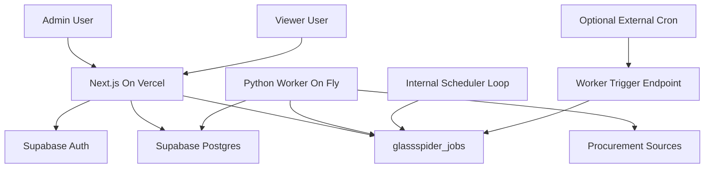

# Glassspider Worker Architecture Refactor

## Target Architecture



Next.js must become a control plane only. It validates users, configures sources/rules, inserts jobs, and displays job/run/data status. It must not fetch procurement pages, crawl links, parse HTML, run retry loops, or use `SUPABASE_SERVICE_ROLE_KEY`.

## Current Problem Areas To Change

- [app/api/admin/runs/route.ts](app/api/admin/runs/route.ts) currently imports `runSourcePipeline()` and uses the service role client. It must enqueue a `glassspider_jobs` row and return immediately.
- [app/api/cron/run-scheduled/route.ts](app/api/cron/run-scheduled/route.ts) currently loops over sources and executes pipeline work. It should be removed from the scraping path or changed to enqueue only without service role; scheduling should move to the worker.
- [app/admin/actions.ts](app/admin/actions.ts) currently runs `runSourcePipeline()` from a server action and uses the service role client. `startSourceRun()` must enqueue only.
- [lib/scraping/run.ts](lib/scraping/run.ts), [lib/scraping/crawler.ts](lib/scraping/crawler.ts), [lib/scraping/scraper.ts](lib/scraping/scraper.ts), and [lib/scraping/normalise.ts](lib/scraping/normalise.ts) contain execution-plane logic inside the Next app. Preserve the logic conceptually, but move execution to `/worker`.

## Phase 1: Add Supabase Job Queue

Add a migration that introduces `glassspider_jobs` without breaking existing tables.

Core columns:

- `id uuid primary key`
- `type` enum: `crawl`, `scrape`, `classify`
- `source_id uuid references glassspider_sources(id)`
- `status` enum: `pending`, `running`, `completed`, `failed`
- `payload jsonb not null default '{}'`
- `attempt_count integer not null default 0`
- `max_attempts integer not null default 3`
- `last_error text`
- `scheduled_at timestamptz not null default now()`
- `started_at timestamptz`
- `completed_at timestamptz`
- `created_at timestamptz not null default now()`

Add indexes for worker polling:

- `(status, scheduled_at)`
- `(source_id, created_at desc)`
- optionally `(type, status, scheduled_at)`

Add database-level consistency controls:

- Partial unique index enforcing one active job per source/type:
  - `unique (source_id, type) where status in ('pending', 'running')`
  - This is mandatory; application-side duplicate checks are not enough.
- Check constraints for valid counters and timestamps:
  - `attempt_count >= 0`
  - `max_attempts > 0`
  - `attempt_count <= max_attempts`
- Optional ownership fields for worker visibility:
  - `locked_by text`
  - `locked_at timestamptz`
  - These make it clear which worker owns a running job.

Add database functions for safe job execution:

- `glassspider_enqueue_job(...)`
  - Inserts a pending job only if the partial unique index allows it.
  - Should be the preferred path for the Next app, worker scheduler, and worker trigger endpoint.
- `glassspider_claim_next_job(worker_id text)`
  - Uses `FOR UPDATE SKIP LOCKED` inside one database transaction.
  - Atomically moves exactly one job from `pending` to `running`.
  - Increments `attempt_count`, sets `started_at`, `locked_by`, and `locked_at`.
  - Returns the claimed job row to the worker.
- `glassspider_complete_job(job_id uuid, worker_id text, result jsonb)`
  - Only completes a job currently `running` and owned by `worker_id`.
- `glassspider_fail_job(job_id uuid, worker_id text, error text, retry_at timestamptz)`
  - Records `last_error`.
  - If attempts remain, transitions the job back to `pending` with `scheduled_at = retry_at`.
  - If attempts are exhausted, transitions it to `failed`.

The implementation must avoid select-then-update job claiming in application code. Claiming must happen through a single atomic database operation.

RLS/security model:

- Authenticated Glassspider admins may insert jobs and read job status.
- Viewer/admin roles may read jobs for dashboard visibility if desired.
- Only the worker service role updates execution fields such as `status`, `attempt_count`, `started_at`, `completed_at`, and `last_error`.

## Mandatory Job Execution Consistency

These rules are part of the architecture, not optional implementation details.

### Single Active Job Per Source Per Type

The system must never allow more than one `pending` or `running` job for the same `(source_id, type)`.

Enforcement:

- Database: partial unique index on `glassspider_jobs(source_id, type)` where `status in ('pending', 'running')`.
- Next enqueue helper: checks for an existing active job before insert and handles unique-index conflicts gracefully.
- Worker scheduler: checks for existing active jobs before enqueueing due work.
- Worker trigger endpoint: uses the same enqueue path and cannot bypass the constraint.

### Atomic Job Claiming

Workers must claim jobs using a single atomic database operation.

Enforcement:

- Implement `glassspider_claim_next_job(worker_id text)` as a Postgres RPC using `FOR UPDATE SKIP LOCKED`.
- The worker calls this RPC; it must not select a job and update it later without a lock.
- Multiple workers may poll concurrently, but only one worker can receive a given job.

### Clear Job Ownership And State Transitions

Once a worker marks a job as `running`, no other worker may update or complete it.

Enforcement:

- Store `locked_by` and `locked_at` on `glassspider_jobs`.
- Complete/fail RPCs must require the matching `worker_id`.
- Valid transitions:
  - `pending -> running -> completed`
  - `pending -> running -> failed`
  - `pending -> running -> pending` only when retrying with backoff and attempts remain.
- No worker should write output for a job it does not own.

### Idempotent Data Writes

Repeated job execution must not create duplicate canonical data.

Enforcement:

- `glassspider_discovered_urls`: keep unique `(source_id, url)` and use upsert.
- `glassspider_bid_records`: keep unique stable source key such as `source_url` or `(source_id, external_reference)` once reliable; use upsert.
- `glassspider_classifications`: add a uniqueness constraint such as `(bid_record_id, classifier, prompt_version)` or `(raw_record_id, classifier, prompt_version)` and use upsert.
- Worker stages must be safe to retry after partial failure.

### Failure Handling

Every failed execution must record enough state for safe retry and debugging.

Enforcement:

- `attempt_count` is incremented during atomic claim, not after failure.
- `last_error` is written on every failed attempt.
- Retries must respect the same single-active-job constraint.
- Backoff is stored in `scheduled_at`; no in-memory-only retry schedule is acceptable.

## Mandatory User-Controlled Pipeline Execution

The pipeline stages are independent operations. The system must not automatically chain crawl, scrape, and classify jobs.

Execution rules:

- `crawl` jobs only discover URLs and write/update `glassspider_discovered_urls`.
- `scrape` jobs only run when explicitly triggered by an admin user or authenticated worker trigger request.
- `scrape` jobs must operate on a defined URL set:
  - explicit `url_ids` selected from the URL map; or
  - an explicit saved filter payload, such as `{ source_id, url_type, status, matched_rule }`.
- `classify` jobs only run when explicitly triggered.
- `classify` jobs must operate on existing raw records or bid records selected by IDs or an explicit filter payload.
- No job type may enqueue another job type as a side effect.
- The UI must support a human review step between stages:
  - review crawl results in the URL map;
  - select or filter URLs for scraping;
  - review scraped records;
  - select or filter records for classification.

This is required for transparency, cost control, compliance review, and avoiding incorrect processing of noisy procurement pages.

## Phase 2: Replace Pipeline Execution In Next With Enqueue-Only Control Plane

Create a Next-side enqueue helper, for example [lib/jobs.ts](lib/jobs.ts):

- `enqueueJob({ type, sourceId, payload, scheduledAt })`
- `listJobs()`
- `retryJob(jobId)` by resetting a failed job or inserting a replacement only through the same database-enforced single-active-job path.

Job payloads must make execution scope explicit:

- Crawl payload example: `{ \"entry_urls\": [...], \"max_pages\": 25 }`
- Scrape payload example: `{ \"url_ids\": [...] }` or `{ \"filter\": { \"source_id\": \"...\", \"status\": \"queued\", \"url_type\": \"detail\" } }`
- Classify payload example: `{ \"bid_record_ids\": [...] }` or `{ \"filter\": { \"review_status\": \"pending\" } }`

Update control-plane routes/actions:

- `POST /api/admin/runs`: validate admin access, validate request, call the enqueue helper/RPC, return `{ jobId, status: "pending" }` or the existing active job. This route must not infer or enqueue follow-on stages.
- `startSourceRun()` in [app/admin/actions.ts](app/admin/actions.ts): insert a job and revalidate admin pages only.
- `POST /api/cron/run-scheduled`: remove heavy execution. Prefer deleting it from the scraping flow; if kept for compatibility, it should only enqueue jobs and must not use `SUPABASE_SERVICE_ROLE_KEY`.

Remove service-role usage from the Next app:

- Delete or stop using `createSupabaseServiceClient()` from Next routes/actions.
- Remove `SUPABASE_SERVICE_ROLE_KEY` from Vercel-facing docs and `.env.example` sections for the web app.
- Keep public/authenticated Supabase access in the web app only.

## Phase 3: Restructure Execution Modules For Worker Ownership

Move execution concepts into `/worker` using Python, while keeping TypeScript source configuration constants only if still useful.

New worker structure:

```text
worker/
  Dockerfile
  fly.toml.example
  requirements.txt
  README.md
  app/
    main.py              # optional FastAPI trigger/health endpoints
    config.py
    db.py                # Supabase service client
    jobs.py              # polling, locking, retry, backoff
    scheduler.py         # source cadence based enqueueing
    pipeline/
      crawl/
        __init__.py
        runner.py
        url_rules.py
      scrape/
        __init__.py
        runner.py
      normalise/
        __init__.py
        html.py
      classify/
        __init__.py
        runner.py
      sources/
        bidstats.py
    tests/
```

Execution stage contracts:

- `crawl(job)`: reads source/rules, visits allowed URLs, writes `glassspider_discovered_urls`, writes/updates run metrics, and stops. It must not enqueue or execute scraping.
- `scrape(job)`: reads only the explicit URL IDs or explicit URL filter in `job.payload`, fetches those pages, writes `glassspider_raw_records` and `glassspider_bid_records`, and stops. It must not enqueue or execute classification.
- `normalise(...)`: pure functions that convert HTML/text into canonical fields.
- `classify(job)`: reads only the explicit record IDs or explicit record filter in `job.payload`, writes `glassspider_classifications`, and stops.

Idempotency requirements:

- URL discovery uses `upsert` on `(source_id, url)`.
- Bid records use `upsert` on stable source URL/reference.
- Classifications use `upsert` on `(bid_record_id, classifier, prompt_version)` or equivalent.
- Raw records may be append-only or content-hash deduped; choose explicitly in code comments/docs.
- Re-running a job should not duplicate canonical records.

## Phase 4: Implement Python Worker Job Lifecycle

Worker responsibilities:

- Poll `glassspider_jobs` where `status = 'pending'` and `scheduled_at <= now()`.
- Lock one job at a time by calling the atomic claim RPC so multiple workers can run safely.
- Set job `status = 'running'`, increment `attempt_count`, set `started_at`.
- Execute the correct pipeline stage.
- Do not enqueue a subsequent job type after stage completion.
- Write output to existing `glassspider_*` data tables.
- On success, set `status = 'completed'`, `completed_at = now()`.
- On failure, write `last_error` and either:
  - reschedule as `pending` with exponential backoff if `attempt_count < max_attempts`, or
  - mark `failed` if attempts are exhausted.

Recommended lock strategy:

- Implement a Postgres RPC such as `glassspider_claim_next_job()` using `FOR UPDATE SKIP LOCKED`.
- Do not implement select-then-update claiming in worker code.
- Complete/fail updates must verify `locked_by = worker_id` so a worker cannot finish another worker's job.

## Phase 5: Worker Scheduling

Use both scheduling paths requested:

- Internal scheduler loop on Fly:
  - Reads active `glassspider_sources`.
  - Uses `crawl_frequency` only to decide due crawl jobs.
  - Inserts only `crawl` jobs via the same enqueue helper/RPC, avoiding duplicates for the same source/type when a pending/running job exists.
  - Must not schedule scrape or classify jobs automatically unless a future product setting explicitly enables that behavior and the UI makes it visible.
- Optional authenticated worker endpoint:
  - `POST /jobs/enqueue-due` or `POST /jobs/enqueue` in FastAPI.
  - Protected by `GLASSSPIDER_WORKER_SECRET`.
  - Can be called by external cron or manually during operations.

Do not rely on Vercel cron for scraping execution. If Vercel cron remains at all, it may only call the worker trigger endpoint; it must not execute scrape code.

## Phase 6: Admin Job Queue UI

Update admin UI to show jobs separately from historical runs:

- Add `listJobs()` to [lib/db.ts](lib/db.ts) or [lib/jobs.ts](lib/jobs.ts).
- Update [app/admin/runs/page.tsx](app/admin/runs/page.tsx) to show:
  - pending/running/completed/failed jobs;
  - type, source, attempt count, max attempts;
  - scheduled/started/completed times;
  - last error;
  - retry action for failed jobs.
- Keep `glassspider_runs` as execution/run telemetry written by the worker, or migrate the UI gradually to jobs plus runs.
- Update [app/admin/url-map/page.tsx](app/admin/url-map/page.tsx) or add a related page so admins can select/filter discovered URLs and explicitly enqueue scrape jobs.
- Add record review controls so admins can select/filter raw or bid records and explicitly enqueue classify jobs.
- Make the UI copy clear that crawl, scrape, and classify are separate manual stages.

## Phase 7: Deployment Documentation

Update docs and env var split.

Vercel web app env:

- `NEXT_PUBLIC_SUPABASE_URL`
- `NEXT_PUBLIC_SUPABASE_PUBLISHABLE_KEY`
- `NEXT_PUBLIC_LAIGHTWORKS_LOGIN_URL`
- `GLASSSPIDER_PROJECT_SLUG`
- `GLASSSPIDER_ADMIN_ROLES`

Fly worker env:

- `SUPABASE_URL`
- `SUPABASE_SERVICE_ROLE_KEY`
- `GLASSSPIDER_WORKER_SECRET`
- optional scheduler/poll interval variables
- optional user agent/rate-limit variables

Docs to update:

- [docs/CURRENT_STATE.md](docs/CURRENT_STATE.md): architecture overview, routes, worker boundary, deployment split.
- [docs/DB_CURRENT_STATE.md](docs/DB_CURRENT_STATE.md): `glassspider_jobs`, RLS, worker write model.
- [docs/SOURCE_INVESTIGATION.md](docs/SOURCE_INVESTIGATION.md): note worker-owned crawl execution and BidStats rate constraints.
- [README.md](README.md): Vercel deployment, Fly deployment, env var separation.
- [AGENTS.md](AGENTS.md): service-role key belongs only in worker/server execution plane.

## Phase 8: Verification

Run after implementation:

- `npm run typecheck`
- `npm run lint`
- `npm run build`
- Python worker checks, likely:
  - `python -m compileall worker/app`
  - `python -m pytest` if tests are added
- Confirm no Next route/action imports `lib/scraping/run`, `crawler`, or `scraper`.
- Confirm no Next route/action imports or calls `createSupabaseServiceClient()`.
- Confirm web docs no longer instruct Vercel to set `SUPABASE_SERVICE_ROLE_KEY`.
- Confirm no worker stage enqueues another stage automatically.
- Confirm scrape/classify jobs require explicit IDs or filter payloads and fail fast without them.

## Expected End State

- Next.js/Vercel validates users, manages configuration, enqueues jobs, and displays status.
- Supabase stores source config, data, job queue, telemetry, and canonical records.
- Python/Fly owns user-triggered scraping/classification, scheduled crawl discovery, retries, service-role writes, and rate-limited external HTTP.
- Crawl, scrape, and classify remain independent user-controlled stages.
- The architecture supports multiple workers later without moving the UI or changing the user-facing product model.