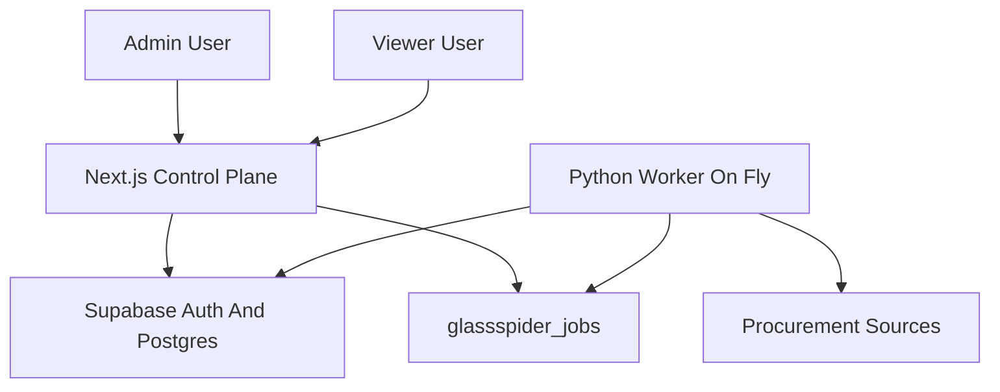

# Current state — glassspider

**Last updated:** 2026-04-26

## Repository

- Early-stage product repo: [glassspider](https://github.com/alaight/glassspider).
- Part of the **Laightworks** hub-and-spoke ecosystem; shares **Supabase/Postgres** with the Laightworks site.

## Database convention

- Any table this product adds for its own data: **`glassspider_<name>`** (e.g. `glassspider_items`).
- Ecosystem-wide tables (e.g. projects registry, access) are shared; confirm names in Supabase before use.

## Application

- Stack: Next.js App Router, TypeScript, Tailwind CSS, Supabase SSR.
- Root page `/` explains the Glassspider workflow and links to protected admin/viewer areas.
- Protected admin routes:
  - `/admin`: source/run overview.
  - `/admin/sources`: source registry and BidStats seed action.
  - `/admin/sources/[id]`: source URL rules.
  - `/admin/runs`: job queue controls, job status, retry actions, and run telemetry.
  - `/admin/url-map`: discovered URL map with explicit scrape job actions.
- Protected viewer routes:
  - `/dashboard`: bid intelligence overview.
  - `/dashboard/search`: searchable bid records and CSV export link.
  - `/dashboard/renewals`: renewal buckets.
  - `/dashboard/records/[id]`: canonical record detail.
- API routes:
  - `POST /api/admin/runs`: admin-triggered job enqueue only.
  - `GET /api/dashboard/export`: viewer CSV export.
  - `POST /api/cron/run-scheduled`: disabled for scraping execution; scheduling belongs to the Fly worker.
- Server-side auth checks validate the Supabase user and shared Laightworks project access for `PROJECT_SLUG = glassspider`.
- Admin roles default to `owner,admin`; viewer roles include owner/admin/member/viewer/analyst/reviewer.

## Architecture

- Next.js/Vercel is the control plane: auth, source configuration, job enqueueing, dashboards, exports.
- Supabase is the system of record: source config, job queue, URL map, raw records, canonical records, classifications.
- Python/Fly is the execution plane: atomic job claiming, crawl/scrape/classify execution, retries, backoff, and service-role writes.
- The web app does not use `SUPABASE_SERVICE_ROLE_KEY`.

## Pipeline execution

- Source/rule configuration lives in Supabase-backed `glassspider_*` tables.
- Job queue state lives in `glassspider_jobs`.
- Execution code lives under `worker/app/pipeline/`.
- Pipeline stages:
  - `crawl`: discovers URLs and stores `glassspider_discovered_urls`, then stops.
  - `scrape`: runs only from explicit selected URL IDs or a filter payload and writes `glassspider_raw_records` / `glassspider_bid_records`.
  - `classify`: runs only from explicit selected records or a filter payload and writes `glassspider_classifications`.
- No pipeline stage automatically enqueues another stage.
- The worker scheduler only enqueues due crawl jobs by default.
- BidStats is seeded as a draft source with query-string crawling disabled per its public robots rules.

## Database

- Shared access bootstrap migration: `supabase/migrations/20260425235900_laightworks_project_access_bootstrap.sql`.
  - Creates hub-level `projects` and `project_access` tables when they are missing.
  - Seeds the canonical `projects.slug = 'glassspider'` registry row.
- Initial migration: `supabase/migrations/20260426000000_glassspider_bid_intelligence_initial_schema.sql`.
- Job queue migration: `supabase/migrations/20260426010000_glassspider_jobs_queue.sql`.
- Database prose: `docs/DB_CURRENT_STATE.md`.
- The local Supabase CLI was unavailable during migration creation, so validate migrations against the live shared schema before applying them.

## Environment

- Required env vars are documented in the root **`README.md`** and `.env.example`.
- The Fly worker uses `worker/fly.toml`; the Docker build context is the **`worker/`** directory (`fly deploy` from `worker/`, or `fly deploy worker --config worker/fly.toml` from the repo root). `worker/Dockerfile` copies `requirements.txt` and `app/` from that context.
