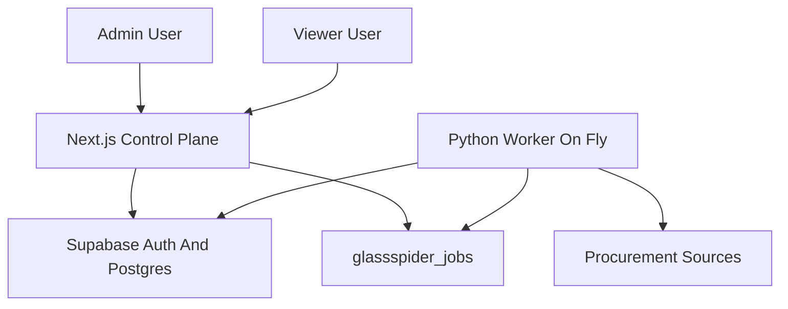

# Current state — glassspider

**Last updated:** 2026-05-03

## Repository

- Early-stage product repo: [glassspider](https://github.com/alaight/glassspider).
- Part of the **Laightworks** hub-and-spoke ecosystem; shares **Supabase/Postgres** with the Laightworks site.

## Database convention

- Any table this product adds for its own data: **`glassspider_<name>`** (e.g. `glassspider_items`).
- Ecosystem-wide tables (e.g. projects registry, access) are shared; confirm names in Supabase before use.

## Application

- Stack: Next.js App Router, TypeScript, Tailwind CSS, Supabase SSR.
- **Primary UI:** single **console shell** (`app/(console)/`): sidebar + main + inspector rail. Copy is intentionally operational (records/items), not a landing site.
- **Routes (canonical):**
  - **`/explore`** (admin): ad-hoc URL fetch + anchors + iframe preview (`POST /api/explore/fetch`); deep-links into Sources with draft/suggested-rule query params.
  - **`/sources`**, **`/sources/[id]`** (admin): registry, crawler rules, BidStats seed.
  - **`/url-map`** (admin): filtered/paged **`glassspider_discovered_urls`**, selection, batch scrape enqueue, optional row tagging (**UPDATE** may be blocked by RLS — see **`docs/DB_CURRENT_STATE.md`**).
  - **`/runs`** (admin): enqueue jobs; **`GET /api/console/jobs`** polling (~5 s); expandable payload/result; retry failed jobs.
  - **`/data`** (viewer+): filtered record explorer; keyword mode uses FTS on **`glassspider_bid_records.search_vector`**; inspector uses **`GET /api/console/records/[id]`** (canonical + raw + classifications).
  - **`/records/[id]`** (viewer+): full-page drill-down JSON + raw + classifier rows.
- **`/`:** role redirect (admins → `/explore`, others → `/data`); sign-in redirects at root when unauthenticated.
- **Legacy:** `/admin/*` and **`/dashboard/*`** redirect into the canonical paths (bookmarks preserved).
- **Additional API routes:** `GET /api/console/jobs`; `GET /api/console/records/[id]`; existing `POST /api/admin/runs`, `GET /api/dashboard/export`, `POST /api/cron/run-scheduled` unchanged in role.
- **Server actions:** `app/actions/console.ts` (enqueue, sources/rules, retries, batch scrape helpers); **`app/admin/actions.ts`** re-exports for compatibility.
- Auth: **`lib/auth.ts`** + shared **`projects` / `project_access`** with **`PROJECT_SLUG = glassspider`**. Admin UI gated by **`GLASSSPIDER_ADMIN_ROLES`** (default `owner,admin`).
- **`proxy.ts`** (Next.js 16+) refreshes Supabase SSR cookies on matched navigations (static assets excluded via matcher). Optional **`SUPABASE_AUTH_COOKIE_DOMAIN=laightworks.com`** aligns `Set-Cookie` domain with the hub so apex sign-in survives on **`*.laightworks.com`** — the hub app must apply the **same** `cookieOptions.domain`.

## Architecture

- Next.js/Vercel is the control plane: auth, source/rule configuration, job enqueueing, **operator console** (Explore / Sources / URL map / Runs), **data explorer**, exports, and bounded Explore fetch endpoint.
- Supabase is the system of record: source config, job queue, URL map, raw records, canonical records, classifications.
- Python/Fly is the execution plane: atomic job claiming, crawl/scrape/classify execution, retries, backoff, and service-role writes.
- The web app does not use `SUPABASE_SERVICE_ROLE_KEY`.

## Worker runtime (Fly)

- The worker is a **FastAPI** app started with **Uvicorn**; on startup it spawns background tasks for **`worker_loop`** (job polling) and **`scheduler_loop`** (due crawl enqueue). The HTTP server stays up even when the queue is empty.
- **`glassspider_claim_next_job`** returns no row when nothing is claimable. Through PostgREST/Supabase this may appear as JSON **`null`**, an **empty list**, or a **dict whose fields are all null** (including **`id`**). The worker treats any payload **without a truthy `id`** as **idle**, waits **`GLASSSPIDER_WORKER_POLL_INTERVAL_SECONDS`** (default 15), and logs a single info line: `No pending jobs, sleeping N seconds`. It does **not** run `Job` validation on those idle shapes, so an empty queue does not produce Pydantic errors.
- A row with a **real `id`** that still fails **`Job.model_validate`** is treated as a **bug or contract mismatch**; the worker logs a traceback for that case, then backs off and retries.
- Exceptions inside **`worker_loop`** other than **`asyncio.CancelledError`** are logged with a traceback; the task **sleeps and continues** so polling does not permanently stop the process.

## Pipeline execution

- Source/rule configuration lives in Supabase-backed `glassspider_*` tables.
- Job queue state lives in `glassspider_jobs`.
- Execution code lives under `worker/app/pipeline/`.
- Pipeline stages:
  - `crawl`: discovers URLs and stores `glassspider_discovered_urls`, then stops.
  - `scrape`: runs only from explicit selected URL IDs or a filter payload and writes `glassspider_raw_records` / `glassspider_bid_records`.
  - `classify`: runs only from explicit selected records or a filter payload and writes `glassspider_classifications`.
- No pipeline stage automatically enqueues another stage.
- The worker scheduler only enqueues due crawl jobs by default.
- BidStats is seeded as a draft source with query-string crawling disabled per its public robots rules.

## Database

- Shared access bootstrap migration: `supabase/migrations/20260425235900_laightworks_project_access_bootstrap.sql`.
  - Creates hub-level `projects` and `project_access` tables when they are missing.
  - Seeds the canonical `projects.slug = 'glassspider'` registry row.
- Initial migration: `supabase/migrations/20260426000000_glassspider_bid_intelligence_initial_schema.sql`.
- Job queue migration: `supabase/migrations/20260426010000_glassspider_jobs_queue.sql`.
- Database prose: `docs/DB_CURRENT_STATE.md`.
- The local Supabase CLI was unavailable during migration creation, so validate migrations against the live shared schema before applying them.

## Environment

- Required env vars are documented in the root **`README.md`** and `.env.example`.
- The Fly worker uses `worker/fly.toml`; deploy from the **repository root** with `fly deploy -c worker/fly.toml`. Docker build context is the **repo root**; `worker/Dockerfile` copies `worker/requirements.txt` and `worker/app`.
